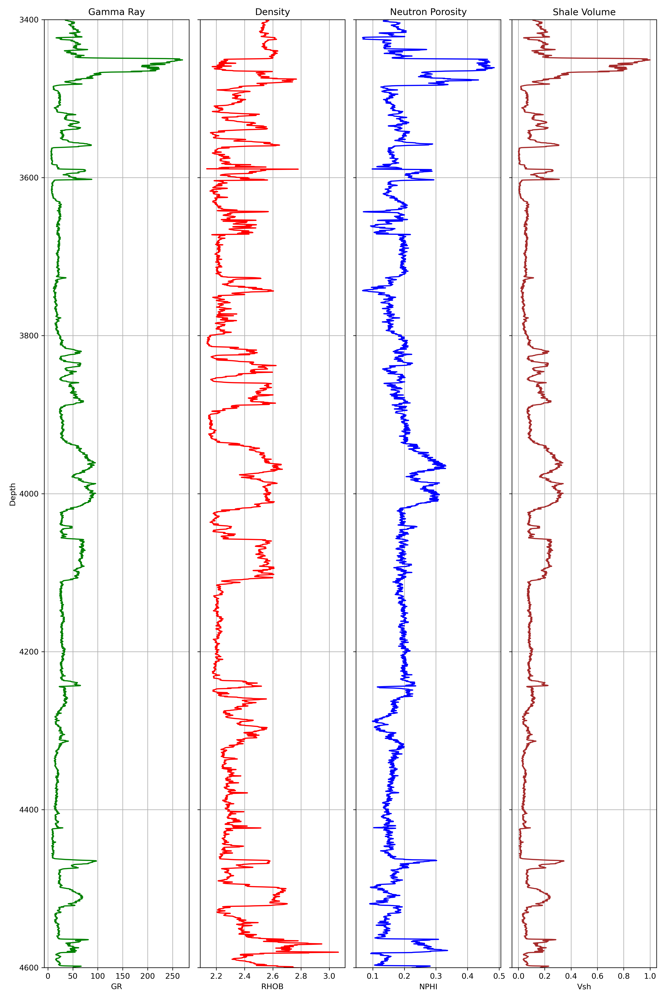

# Open-Hole-Log

This project demonstrates a basic open-hole log interpretation workflow using Python and LAS well-log data.

The workflow includes:
- Gamma Ray interpretation
- Shale volume estimation
- Reservoir flagging
- Density and neutron porosity analysis
- Industry-style well-log visualisation

- ## Logs Used

- GR → Gamma Ray
- RHOB → Bulk Density
- NPHI → Neutron Porosity
- Vsh → Estimated shale volume

- ## Shale Volume Estimation

Shale volume was estimated using Gamma Ray normalisation:

Vsh = (GR − GRmin) / (GRmax − GRmin)

Where:
- Low Vsh indicates cleaner formations
- High Vsh indicates shale-rich formations

- ## Reservoir Screening

Cleaner intervals were identified using:

Vsh < 0.35

These intervals may represent formations with better reservoir potential.

## Result

The workflow successfully highlighted:
- Clean reservoir intervals
- Shale-rich zones
- Formation heterogeneity across depth

- ## Open-Hole Interpretation Plot

## Requirements

- lasio
- pandas
- matplotlib
